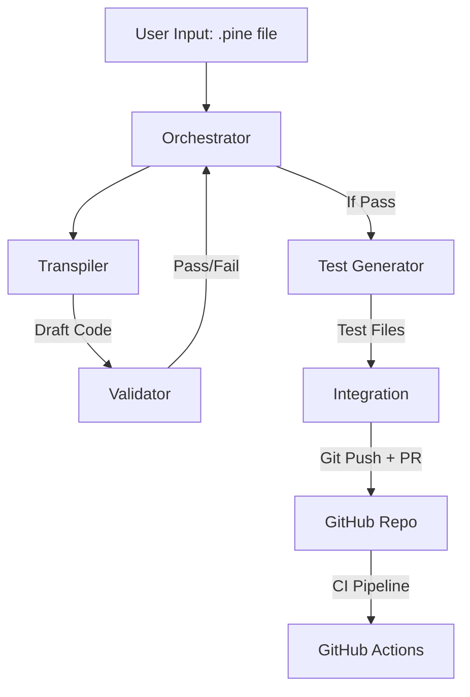

```markdown
# Pine Script to Python Transpiler: System Architecture

## 1. Executive Summary
This project implements an **AI-Driven Automated Transpilation Pipeline** designed to convert algorithmic trading strategies from **TradingView Pine Script v5** into a production-grade **Python** framework.

The system utilizes a **Multi-Agent Architecture**, where specialized AI agents (Transpiler, Validator, QA) collaborate under a central Orchestrator to ensure code quality, logical accuracy, and strict prevention of lookahead bias. The final output is a vectorized Python strategy (Pandas/TA-Lib) wrapped in a standard `BaseStrategy` class, accompanied by automated unit tests and submitted via a GitHub Pull Request.

---

## 2. Core Design Principles

### 2.1 Vectorization over Iteration
Pine Script operates on a bar-by-bar basis. Direct translation to Python loops is slow and inefficient.
* **Approach:** We convert Pine series logic into **Pandas Vectorized Operations**.
* **Benefit:** Orders of magnitude faster backtesting and alignment with the Python data science ecosystem (NumPy/Pandas).

### 2.2 Strict Anti-Lookahead Bias
A common failure in algorithmic trading is "peeking" at future data during backtests.
* **Enforcement:**
    1.  **Validator Agent:** Statically analyzes code to ensure all `shift()` operations are backward-looking.
    2.  **Architecture:** Multi-timeframe data MUST use the provided `resample_to_interval` and `resampled_merge` utilities. Direct use of `df.resample()` inside strategies is forbidden.

### 2.3 Human-in-the-Loop (HITL)
AI is powerful but not infallible. The pipeline does not auto-deploy to production.
* **Workflow:** The pipeline ends by creating a **Pull Request (PR)**.
* **Requirement:** A human developer must perform a Code Review and merge the PR, ensuring a final safety check.

### 2.4 Separation of Concerns
* **Strategy:** Pure logic. It receives Data + Timestamp and returns a `SignalType` (LONG/SHORT/FLAT). It knows nothing about position sizing, fees, or brokers.
* **Execution Engine:** Handles risk management, stop-losses, and order routing (external to this specific transpiler project).

---

## 3. The Agent Swarm Architecture

The system is orchestrated by a team of specialized AI agents defined in `.claude/agents/`.



### 3.1 Orchestrator Agent (`orchestrator.md`)

* **Role:** Project Manager.
* **Responsibility:** Manages the state of the conversion. It routes tasks to sub-agents sequentially according to the `CONVERSION_FLOW.md`. It handles error reporting and stops the pipeline if any step fails.

### 3.2 Transpiler Agent (`transpiler.md`)

* **Role:** Senior Python Developer.
* **Responsibility:** Converts Pine Script syntax to Python.
* **Knowledge Base:** Uses `PINESCRIPT_REFERENCE.md` to map:
* `ta.sma` → `talib.SMA`
* `ta.crossover` → Vectorized Pandas Logic
* `request.security` → `src.utils.resample` patterns.


* **Output:** A clean `src/strategies/<name>.py` file inheriting from `BaseStrategy`.

### 3.3 Validator Agent (`validator.md`)

* **Role:** Security & Compliance Officer.
* **Responsibility:** Performs static code analysis.
* **Checks:**
* Is the class structure correct?
* Are forbidden functions (e.g., `future_shift`) used?
* Is multi-timeframe logic using the correct utilities?


* **Action:** Rejects code that violates the `BASE_STRATEGY_CONTRACT`.

### 3.4 Test Generator Agent (`test_generator.md`)

* **Role:** QA Automation Engineer.
* **Responsibility:** Writes `pytest` based unit tests.
* **Mechanism:** Uses the `sample_ohlcv_data` fixture (from `conftest.py`) to simulate market regimes (Sideways, Bull, Bear) and verify the strategy generates signals without crashing.

### 3.5 Integration Agent (`integration.md`)

* **Role:** DevOps / Release Manager.
* **Responsibility:** Git operations.
* **Action:** Creates a feature branch, commits the Strategy + Tests, and uses **GitHub MCP** to open a Pull Request for human review.

---

## 4. Technical Stack

| Component | Technology | Purpose |
| --- | --- | --- |
| **Language** | Python 3.11+ | Core logic and execution. |
| **DataFrames** | Pandas | Vectorized data manipulation. |
| **Indicators** | TA-Lib | Standard technical analysis library (C-based, fast). |
| **Math** | NumPy | Mathematical operations and array handling. |
| **Testing** | Pytest | Unit and integration testing framework. |
| **CI/CD** | GitHub Actions | Automated remote testing upon PR creation. |
| **Scraping** | Selenium | Fetching Pine Script code from TradingView. |

---

## 5. Detailed Data Flow & Logic Handling

### 5.1 Data Standardization

* **Format:** All dataframes are OHLCV (Open, High, Low, Close, Volume).
* **Timezone:** Strict **UTC** enforcement (ISO 8601 compatible).
* **Validation:** High must be `>=` Low/Open/Close at all times.

### 5.2 Handling Missing Indicators

While TA-Lib covers 80% of indicators, Pine Script v5 has unique functions. The architecture mandates manual Pandas implementations for:

* **RMA (Running Moving Average):** Implemented via `df.ewm(alpha=1/len)`.
* **Supertrend:** Implemented via custom ATR band logic in Python.
* **VWAP:** Calculated via cumulative volume-weighted price formula.

### 5.3 Multi-Timeframe (MTF) Logic

To prevent looking into the future when using higher timeframe data (e.g., using a Daily Close while trading on a 15-minute chart):

1. **Resample:** The system upsamples the 15m data to 1D using `resample_to_interval`.
2. **Calculate:** Indicators are computed on the 1D data.
3. **Merge:** The 1D data is merged back to the 15m timeframe using `resampled_merge` with forward-filling (`ffill`). This ensures that at 10:00 AM, the strategy only sees the *previous day's* close, not the *current day's* closing price (which hasn't happened yet).

---

## 6. Directory Structure

```text
project_root/
├── .claude/
│   ├── agents/            # Prompts defining Agent Personas
│   └── skills/            # Knowledge Bases (Pine Ref, Validation Checklist)
├── .github/
│   └── workflows/         # CI/CD Pipeline (ci.yml)
├── input/                 # Drop .pine files here
├── src/
│   ├── strategies/        # Generated Python strategies go here
│   ├── utils/             # Helper functions (resampling, scraper)
│   └── base_strategy.py   # Abstract Base Class (The Contract)
├── tests/
│   ├── strategies/        # Generated Test files go here
│   └── conftest.py        # Shared Fixtures (Mock Market Data)
├── runner.py              # Entry point script
├── requirements.txt       # Python dependencies
└── ARCHITECTURE.md        # This file

```

---

## 7. The Conversion Lifecycle (Step-by-Step)

1. **Ingestion:** User places `strategy.pine` in `/input` and runs `runner.py`.
2. **Transpilation:**
* The **Transpiler** reads the file.
* It identifies inputs, indicators, and logic.
* It maps logic to Pandas/TA-Lib using `PINESCRIPT_REFERENCE.md`.
* It writes `src/strategies/new_strategy.py`.


3. **Validation:**
* The **Validator** scans `new_strategy.py`.
* Checks for `future_shift` or direct `resample` usage.
* If valid, proceeds. If invalid, aborts.


4. **QA Setup:**
* The **Test Generator** reads the new strategy class.
* It creates `tests/strategies/test_new_strategy.py`.
* It imports `sample_ohlcv_data` to simulate a Bull/Bear market run.


5. **Deployment:**
* The **Integration Agent** creates branch `feat/new_strategy`.
* Commits files.
* Pushes to GitHub.
* Opens a Pull Request.


6. **Verification:**
* GitHub Actions triggers `pytest`.
* User reviews code and merges.


---

```

```